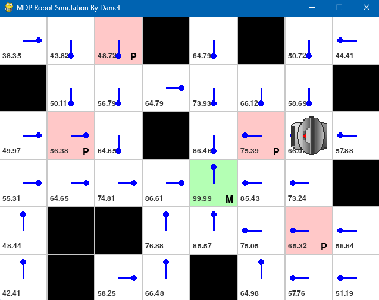

# MDP-Robot-Simulation
## Proyecto 2 - Robótica

Este proyecto implementa el algoritmo de **Value Iteration** sobre un entorno 2D para la navegación de un robot móvil, aplicando conceptos de **Procesos de Decisión de Markov (MDP)**. Se incluye una visualización gráfica interactiva con PyGame y análisis de robustez mediante variaciones en la probabilidad de éxito de las acciones.

## Autor

- Daniel Peña

---

## Descripción

### Objetivos

- Modelar el entorno como un MDP.
- Generar matrices de transición para las acciones Norte, Sur, Este y Oeste, considerando incertidumbre.
- Aplicar Value Iteration para obtener políticas óptimas con distintos factores de descuento (`γ` o `lambda`).
- Visualizar la política óptima sobre el mapa con simulación gráfica.
- Evaluar la robustez de las políticas ante diferentes escenarios de probabilidad de éxito.

### Mapa

El entorno está representado como una matriz:

- `0`: celda libre  
- `1`: obstáculo  
- `2`: penalización  
- `3`: meta

---

## Requisitos

- Python 3.9+
- `pygame`
- `numpy`
- `matplotlib`

### Instalación de dependencias

```bash
pip install pygame numpy matplotlib

---

## Simulacion:


